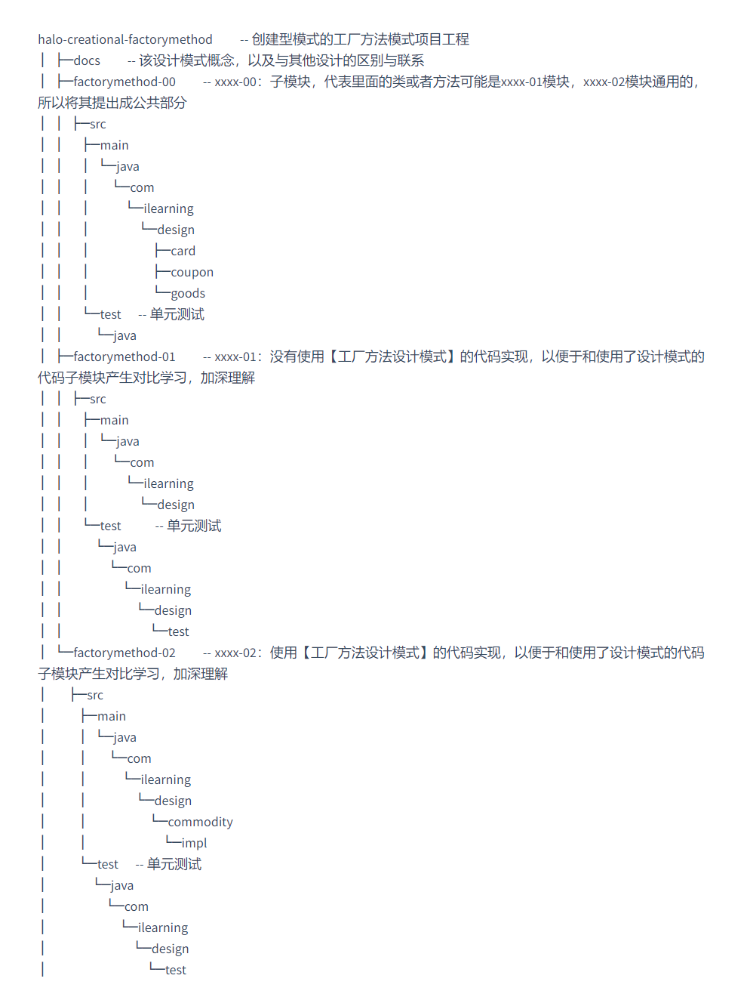

# Skyline of 《halo-designpatterns》

> - :a: author：yuwenbo
> - :alarm_clock: date：2022-05-26 00:00

> 每个人的心里，都有一个纯净的世界。
>
> 白天有和煦的阳光，一直温暖着自己，坚持下去，照亮每一个明天；
>
> 夜晚有静谧的月光，一直安慰着自己，洒向归途，不迷失初心方向。
>
> 在这个世界里，
>
> 不太焦虑，耐得住寂寞，用自律培养自信。最终以自信拥抱世界。
>
> 在这个世界里，
>
> 不张扬，因为真诚待人。
>
> 在这个世界里，
>
> 不喧哗，因为真实待己。
>
> 在这个世界里，
>
> 不荒芜，因为懂得珍惜。

----

### :fire: ​学习 `设计模式` 源码：[halo-designpatterns](https://github.com/ywbo/halo-designpatterns)
----
> 流转于指尖的记忆，即使一瞬，亦是永恒。 ——致自己

----

### 项目目录结构说明（以创建型模式的工厂方法模式为例）：

设计模式大体概括为：创建型模式（creational），结构型模式（structure），行为型模式（behavior）三类。每种大的分类下又有好几种具体的模式。

----

资料参考：

- [免费在线学习代码重构](https://refactoringguru.cn/)
- [软件设计模式](http://c.biancheng.net/view/1317.html)
